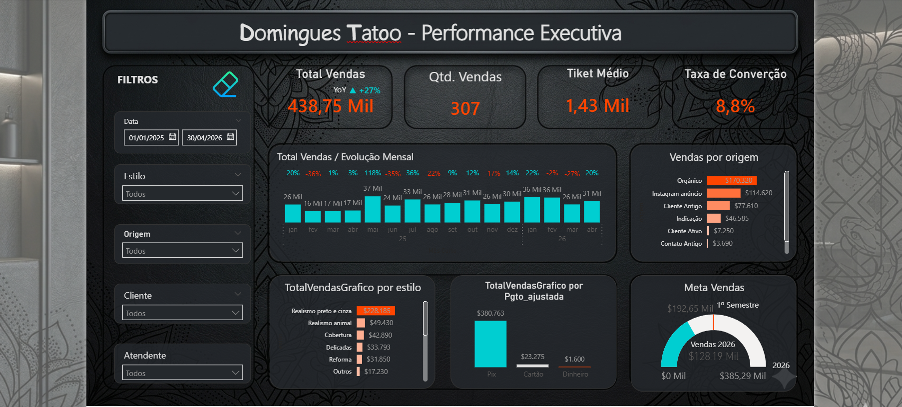

#  Data Analytics & Forecast: Inteligência de Negócios para Studio de Tattoo

**Autor:** Jonathas Fernandes  
**Expertise:** Data Engineer | Data Analyst | Lean Six Sigma Green Belt

---

##  1. Visão Geral do Projeto
Este projeto demonstra a construção de um ecossistema de dados **end-to-end** dentro do Databricks. O objetivo principal é transformar registos operacionais brutos de um estúdio de tatuagem em **previsibilidade financeira** e **estratégia comercial**, permitindo uma transição da gestão por intuição para a **gestão orientada por dados (Data-Driven)**.

##  Stack Tecnológica
* **Processamento de Dados:** PySpark (Spark SQL) para escalabilidade.
* **Armazenamento:** Delta Lake (Implementação de Arquitetura Medalhão - Camada Silver).
* **Linguagem:** Python.
* **Modelagem Estatística:** SARIMA (Seasonal Autoregressive Integrated Moving Average) para Forecast.
* **Ambiente:** Databricks.

##  Diferenciais Estratégicos Implementados
* **Engenharia de Dados Sênior:** Normalização robusta de caracteres e tratamento de tipos financeiros via Regex.
* **Conformidade LGPD:** Implementação de funções de anonimização para dados sensíveis (WhatsApp), garantindo a privacidade dos clientes.
* **Governança de Dados:** Persistência em tabelas Delta para garantir integridade, suporte a cargas incrementais e controle de versão (Time Travel).
* **Machine Learning & Forecast:** Modelagem de sazonalidade para prever picos de faturamento e auxiliar na gestão de caixa.

##  Impactos no Negócio
Com este pipeline, o gestor consegue responder a perguntas críticas:
1.  **Qual a projeção de faturamento para 2026?** (Baseado no modelo SARIMA).
2.  **Qual o principal gargalo do funil de vendas?** (Identificação de motivos de perda de leads).
3.  **Qual estilo de tatuagem gera maior retorno?** (Análise de mix de produtos e ticket médio).

## Camada de Visualização & BI
Após o processamento dos dados no Databricks, conectei a camada Silver/Gold ao Power BI para criar um Dashboard Executivo focado em ROI e performance de mercado.

### Principais Entregas:
* **Previsibilidade Financeira**: Implementação do modelo SARIMA para forecast de vendas 2026.
* **Análise YoY (Year-over-Year)**: Medidas DAX avançadas para monitorar crescimento de +27%.
* **Pareto de Estilos**: Identificação de que o estilo "Realismo" lidera o faturamento (R$ 228k).

